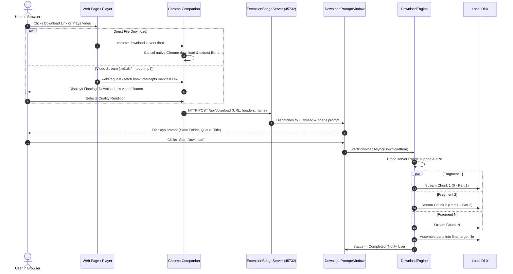

# 🔧 Wrench Downloader - Architecture & Download Grabber Deep Dive

> Comprehensive technical guide to **Wrench Downloader**, its internal components, and how it intercepts, sniffs, and downloads files and media streams like Internet Download Manager (IDM).

---

## 📑 Table of Contents
1. [Overview](#1-overview)
2. [High-Level Architecture](#2-high-level-architecture)
3. [How Downloads Are Grabbed (Step-by-Step)](#3-how-downloads-are-grabbed-step-by-step)
   - [Method A: Standard Browser Downloads Interception](#method-a-standard-browser-downloads-interception)
   - [Method B: Streaming Media Sniffing (HLS / DASH / Web Video)](#method-b-streaming-media-sniffing-hls--dash--web-video)
   - [Method C: In-Page Fetch / XHR Network Hooking](#method-c-in-page-fetch--xhr-network-hooking)
   - [Method D: Desktop Clipboard URL Monitoring](#method-d-desktop-clipboard-url-monitoring)
   - [Method E: Manual URL Insertion](#method-e-manual-url-insertion)
4. [Chrome Companion Extension Deep Dive](#4-chrome-companion-extension-deep-dive)
5. [Local Desktop Bridge (`ExtensionBridgeServer`)](#5-local-desktop-bridge-extensionbridgeserver)
6. [The Download Engine (`DownloadEngine`)](#6-the-download-engine-downloadengine)
   - [Multi-Fragment Concurrent Downloader](#multi-fragment-concurrent-downloader)
   - [HLS, DASH & Complex Stream Processing](#hls-dash--complex-stream-processing)
   - [Speed Limiting & Dynamic Bandwidth Throttling](#speed-limiting--dynamic-bandwidth-throttling)
7. [Queue Management & State Persistence](#7-queue-management--state-persistence)
8. [Summary Sequence Diagram](#8-summary-sequence-diagram)

---

## 1. Overview

**Wrench Downloader** is a high-performance Windows desktop application built with **.NET 9** and **Windows App SDK (WinUI 3)**. It is paired with a **Chromium Companion Extension (Manifest V3)** that runs in Google Chrome, Microsoft Edge, Brave, and other Chromium browsers.

Together, they recreate and modernize the seamless download interception and stream sniffing workflow popular in classic download managers like IDM, while using modern asynchronous I/O, multi-part chunking, and isolated portable storage.

---

## 2. High-Level Architecture

The system consists of three primary interconnected layers:

```
┌─────────────────────────────────────────────────────────────┐
│                      Chromium Browser                       │
│                                                             │
│  ┌──────────────┐     ┌──────────────┐    ┌──────────────┐  │
│  │ injected.js  │────▶│  content.js  │───▶│background.js │  │
│  │ (Main World) │     │(DOM Overlay) │    │(Service Wkr) │  │
│  └──────────────┘     └──────────────┘    └──────────────┘  │
└───────────────────────────────────────────────────┬─────────┘
                                                    │ HTTP POST
                                                    │ (127.0.0.1:45732)
┌───────────────────────────────────────────────────▼─────────┐
│              Wrench Downloader Desktop App                  │
│                                                             │
│  ┌───────────────────────────────────────────────────────┐  │
│  │         ExtensionBridgeServer (C# HttpListener)       │  │
│  └───────────────────────────┬───────────────────────────┘  │
│                              │ Dispatches DownloadItem      │
│  ┌───────────────────────────▼───────────────────────────┐  │
│  │     DownloadPromptWindow  /  MainWindow (WinUI 3)     │  │
│  └───────────────────────────┬───────────────────────────┘  │
│                              │ Starts                       │
│  ┌───────────────────────────▼───────────────────────────┐  │
│  │                     DownloadEngine                    │  │
│  │   - Multi-Fragment HTTP Part Engine (Direct Files)    │  │
│  │   - Stream Demuxer & yt-dlp Core (HLS / DASH / MP4)   │  │
│  │   - Rate Throttler, Chunk Reassembly, Resume Cache    │  │
│  └───────────────────────────────────────────────────────┘  │
└─────────────────────────────────────────────────────────────┘
```

---

## 3. How Downloads Are Grabbed (Step-by-Step)

Wrench Downloader intercepts downloads through five distinct mechanisms depending on where and how the resource originates:

### Method A: Standard Browser Downloads Interception

When you click a download link for files like `.zip`, `.exe`, `.iso`, `.pdf`, `.mp4`, or mirror links on MediaFire, Google Drive, Mega, etc.:

1. **Browser Triggers Download**: Chromium creates an internal download item.
2. **`chrome.downloads.onDeterminingFilename` Hook**:
   - The companion's [`background.js`](file:///g:/megacloud/projects/github/wrench%20downloader/chrome%20extension/background.js) registers an event listener on `chrome.downloads.onDeterminingFilename`.
   - This listener fires after the browser has negotiated HTTP redirects and received server headers (specifically `Content-Disposition` and `Content-Type`).
3. **Capture Headers & Filename**:
   - The extension matches the URL against previously captured request headers (preserving `Referer` and `User-Agent`).
   - It extracts the authentic server filename from the `Content-Disposition` header (RFC 5987 / RFC 6266 UTF-8 encoded names) or `downloadItem.filename`.
4. **Cancel Native Download**:
   - The extension immediately invokes `chrome.downloads.cancel(downloadItem.id)` followed by `chrome.downloads.erase({ id: downloadItem.id })` to prevent Chrome from saving the file with its slow, single-threaded browser engine.
5. **Send to Desktop App**:
   - The extension formats an HTTP POST payload and sends it to the desktop bridge on `http://127.0.0.1:45732/api/download`.
6. **Pop Prompt Window**:
   - The desktop app brings [`DownloadPromptWindow`](file:///g:/megacloud/projects/github/wrench%20downloader/DownloadPromptWindow.xaml.cs) to the foreground with the prefilled filename, destination folder, and queue options.

---

### Method B: Streaming Media Sniffing (HLS / DASH / Web Video)

Web video players (YouTube, Twitter/X, Reddit, TikTok, Vimeo, Twitch, JWPlayer, Video.js) do not trigger standard browser downloads. Instead, they stream video in real-time.

1. **Web Request Sniffing**:
   - [`background.js`](file:///g:/megacloud/projects/github/wrench%20downloader/chrome%20extension/background.js) monitors `chrome.webRequest.onBeforeSendHeaders` and `chrome.webRequest.onHeadersReceived`.
2. **Header & MIME Inspection**:
   - It examines every network request for video/audio signatures:
     - MIME Types: `application/vnd.apple.mpegurl`, `application/x-mpegurl`, `application/dash+xml`, `video/*`, `audio/*`.
     - File Signatures: `.m3u8`, `.mpd`, `.mp4`, `.webm`, `.m4v`, `.ts`.
     - Request Filters: Sub-segment ping requests (`/videoplayback`, `/segment`, `range=`, `.m4s`) are filtered out to keep the playlist clean.
3. **Context Association**:
   - The detected stream is associated with its originating tab ID, along with the tab's `Referer` and `User-Agent`.
4. **Floating Download Button**:
   - [`content.js`](file:///g:/megacloud/projects/github/wrench%20downloader/chrome%20extension/content.js) injects a floating **"Download this video"** badge near the upper-right corner of the video player.
   - Clicking the badge opens a menu with available renditions and direct qualities (e.g. 1080p, 720p, 480p, audio MP3).
   - Choosing a rendition forwards the exact stream URL and headers straight to the desktop app.

---

### Method C: In-Page Fetch / XHR Network Hooking

Modern single-page applications (SPAs) frequently request media manifests through internal JavaScript `fetch()` or `XMLHttpRequest` instances that bypass standard web request listeners.

1. **Early Injection (`injected.js`)**:
   - In [`manifest.json`](file:///g:/megacloud/projects/github/wrench%20downloader/chrome%20extension/manifest.json), `injected.js` runs at `document_start` in the `MAIN` execution world (inside the page context).
2. **Monkey-Patching Native APIs**:
   - It intercepts `window.fetch` and `window.XMLHttpRequest.prototype.open` / `send`.
3. **Stream Event Dispatching**:
   - As soon as a player script requests a manifest like `master.m3u8` or `manifest.mpd`, `injected.js` intercepts the URL and dispatches a Custom DOM Event: `__WRENCH_STREAM_CAPTURED__`.
4. **Relay to Content Script**:
   - [`content.js`](file:///g:/megacloud/projects/github/wrench%20downloader/chrome%20extension/content.js) catches this event, maps it to the closest playing `<video>` element, and passes it to `background.js` to ensure zero missed streams.

---

### Method D: Desktop Clipboard URL Monitoring

If the user copies a link anywhere in Windows:
1. When enabled in **Settings → Downloads → Monitor Clipboard**, [`MainWindow.xaml.cs`](file:///g:/megacloud/projects/github/wrench%20downloader/MainWindow.xaml.cs) attaches a listener to `Clipboard.ContentChanged`.
2. When text matching an HTTP/HTTPS URL with downloadable file extensions or supported streaming domains is copied, Wrench Downloader automatically awakens and displays the `DownloadPromptWindow` with the destination and format ready.

---

### Method E: Manual URL Insertion

Users can paste any direct file link, video page link, or playlist link directly into the top bar of [`MainWindow.xaml`](file:///g:/megacloud/projects/github/wrench%20downloader/MainWindow.xaml) and click **"Add Download"**.

---

## 4. Chrome Companion Extension Deep Dive

The extension files located in [`chrome extension/`](file:///g:/megacloud/projects/github/wrench%20downloader/chrome%20extension/) perform specific roles:

| File | Context / World | Purpose |
|---|---|---|
| `manifest.json` | Manifest V3 | Declares `downloads`, `webRequest`, `webRequestExtraHeaders`, and host permissions across `<all_urls>`. |
| `background.js` | Service Worker | Handles `chrome.downloads` cancellation, `webRequest` header inspection, stream cache per tab, and the desktop HTTP client. |
| `injected.js` | MAIN World | Monkey-patches `fetch` & `XHR` to catch dynamically loaded HLS/DASH streams inside web players. |
| `content.js` | Isolated World | Finds `<video>` elements in the DOM, scopes videos on timeline feeds (X/Twitter, Reddit), and renders the download widget. |
| `popup.html / .js` | Extension Popup | Displays all detected videos and audio files on the current tab with quality selectors and one-click download buttons. |

---

## 5. Local Desktop Bridge (`ExtensionBridgeServer`)

The desktop app runs a lightweight HTTP server implemented in [`ExtensionBridgeServer.cs`](file:///g:/megacloud/projects/github/wrench%20downloader/ExtensionBridgeServer.cs) using .NET's `HttpListener`.

### Bridge Endpoints:
- `GET /api/health`: Returns `{"status":"ok","app":"Wrench Downloader"}`. Used by the Chrome extension to detect if the desktop app is running and update the icon status badge.
- `POST /api/download`: Accepts a JSON payload containing:
  ```json
  {
    "url": "https://example.com/file.zip",
    "title": "Setup_File.zip",
    "quality": "file",
    "format": "zip",
    "pageUrl": "https://example.com/download-page",
    "referrer": "https://example.com/",
    "userAgent": "Mozilla/5.0 ...",
    "prompt": true
  }
  ```
- **CORS & Private Network Access (PNA)**:
  `ExtensionBridgeServer` injects headers to satisfy modern Chromium Private Network Access policies:
  ```http
  Access-Control-Allow-Origin: *
  Access-Control-Allow-Methods: POST, GET, OPTIONS
  Access-Control-Allow-Headers: Content-Type, Access-Control-Request-Private-Network
  Access-Control-Allow-Private-Network: true
  ```

---

## 6. The Download Engine (`DownloadEngine`)

Once confirmed, the download is dispatched to [`DownloadEngine.cs`](file:///g:/megacloud/projects/github/wrench%20downloader/DownloadEngine.cs). The engine routes the task based on URL characteristics:

### Multi-Fragment Concurrent Downloader
For direct HTTP/HTTPS files:
1. **Header Probe (`HEAD` / Range Probe)**:
   - Queries `Accept-Ranges: bytes` and `Content-Length`.
2. **Dynamic Fragment Allocation**:
   - If range requests are supported and the file size exceeds 2 MB, the file is segmented into `N` concurrent chunks (configurable from 1 to 32 parallel fragments in Settings; default is 8).
3. **Parallel Fragment Streams**:
   - Each fragment opens an independent HTTP connection with a byte range: `Range: bytes=start-end`.
   - Data streams directly into a `.part_X` file using high-speed 512 KB unbuffered I/O.
4. **Assembly**:
   - Upon completion of all chunks, the fragments are concatenated sequentially into the final file and the temporary `.part` files are deleted.
5. **Resume Support**:
   - If interrupted, existing `.part` files are checked on disk, and resuming continues from the exact byte offset where it left off.

### HLS, DASH & Complex Stream Processing
For video streaming manifests or protected platforms:
- The engine uses integrated streaming handlers and the bundled `yt-dlp` tool.
- Master playlists are demuxed to find matching audio and video renditions (e.g. 1080p video stream + highest bitrate AAC audio).
- Parts are downloaded to an isolated intermediate temporary directory (`.wrench_temp`), and merged into a standard container (`.mp4` / `.mkv`) using FFmpeg.

### Speed Limiting & Dynamic Bandwidth Throttling
- When a maximum speed cap is configured (in KB/s), the engine applies an asynchronous token bucket throttler across reading buffers, ensuring downloads do not saturate the user's internet connection.

---

## 7. Queue Management & State Persistence

- **Queues**: Downloads can run immediately or be queued (`WaitForQueueStart`). A periodic timer in [`MainWindow.xaml.cs`](file:///g:/megacloud/projects/github/wrench%20downloader/MainWindow.xaml.cs) pumps the queue according to the configured `MaximumConcurrentDownloads` limit.
- **Organization**: When enabled, files are automatically sorted into folders by media category (`Videos`, `Audio`, `Documents`, `Archives`, `Images`).
- **Persistence**: All download records, progress status, and target paths are persisted in `history.json` in the portable `Data/` directory.

---

## 8. Summary Sequence Diagram


